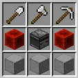
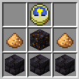

# AdditionalUtilities
サバイバル用のユーティリティ追加データパック

------

## 導入方法

#### 手順1: AdditionalUtilitiesをDLする

###### 方法1: Git経由でDL

gitが導入されている場合はminecraftセーブデータのdatapacksフォルダ内でターミナルを起動しリポジトリをクローン

``$ git clone https://github.com/txkodo/AdditionalUtilities``

###### 方法2: Zip形式でDL

github右上の緑色の[Code]ボタンからDownload Zipを押下し、minecraftセーブデータのdatapacksフォルダ内に移動

#### 手順2: minecraft内で有効化する

minecraftで該当ワールドを開くことで自動的に導入される。

導入成功ログが出ることを確認する

###### 導入成功ログが出なかった場合

minecraft内で下記コマンドを打つ

``/function adu:core/init``

------

## ユーティリティ一覧

### breaker

目の前にあるブロックを内部インベントリのツールで破壊する。

左上スロットに破壊ツールを入れることで正面のブロックを破壊し、右スロットに採掘結果が入る。

### chunk_loader

設置されたチャンクを常に読み込む。

